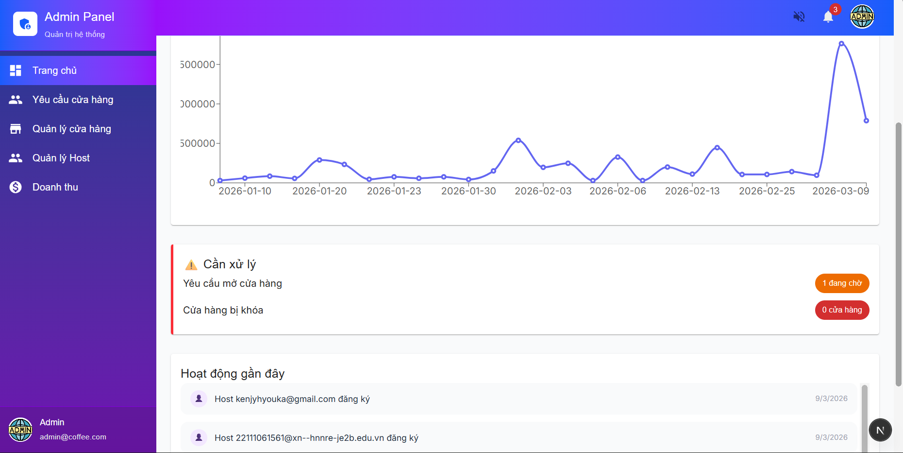
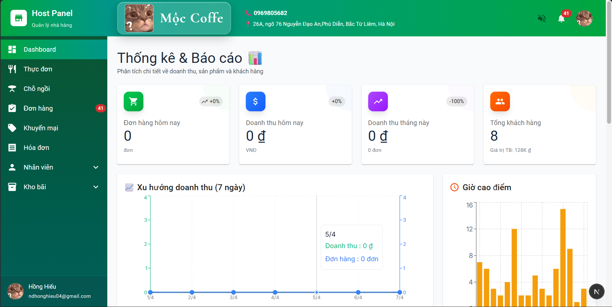
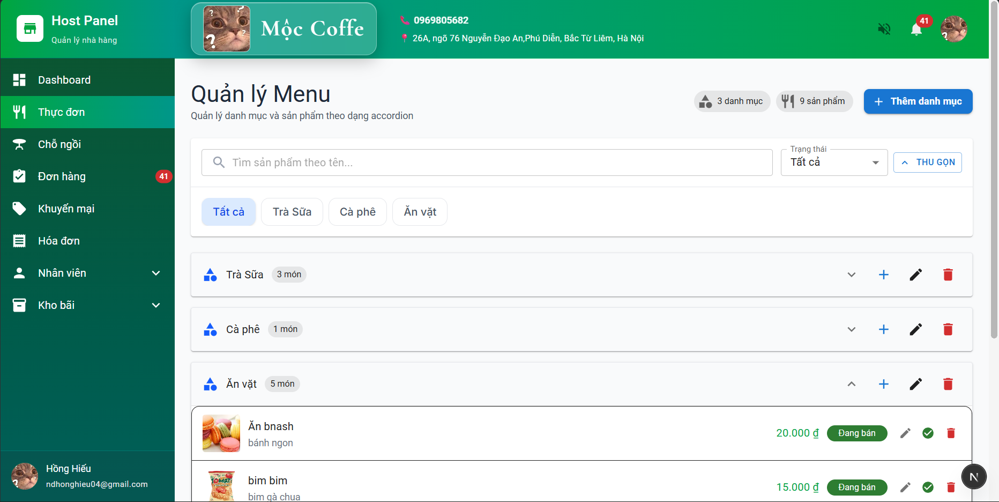
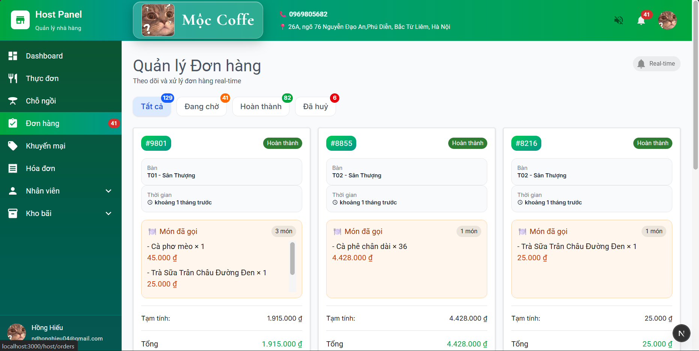
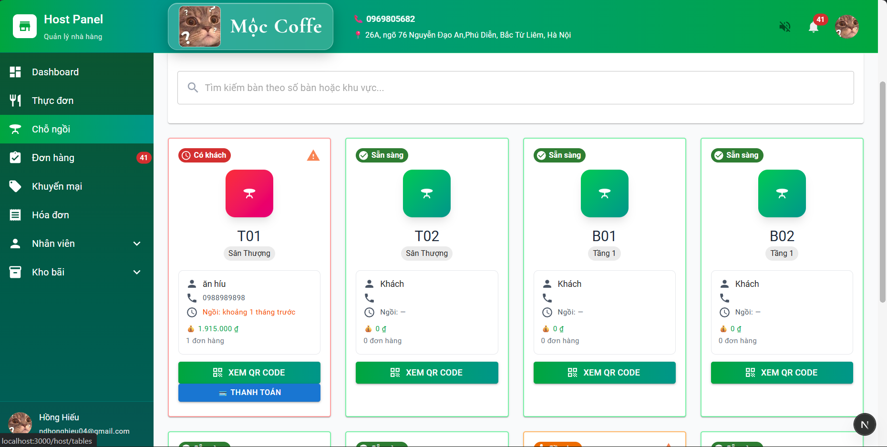
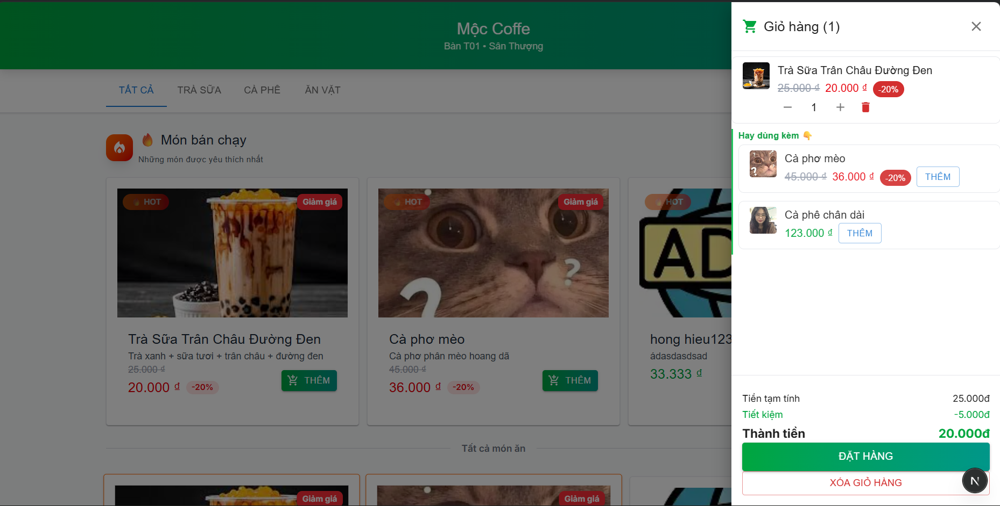

# Coffee Shop Frontend

## Tổng quan dự án

Dự án là frontend của một hệ thống quản lý quán cà phê được xây dựng bằng **Next.js 16** và **React 19**. Mục tiêu là tạo ra một giao diện hiện đại cho 3 nhóm người dùng chính:

- **Admin**: quản lý cửa hàng, duyệt yêu cầu mở cửa hàng
- **Host**: quản lý menu, bàn, đơn hàng, tồn kho và thống kê
- **Khách hàng**: xem menu và đặt món trực tiếp qua web

## Điểm nổi bật

- **Kiến trúc Next.js App Router** với cấu trúc route rõ ràng
- **TypeScript đầy đủ** giúp tăng tính ổn định khi phát triển
- **MUI (Material UI)** kết hợp **Tailwind CSS** để dựng giao diện thân thiện
- **Zustand** quản lý trạng thái cho xác thực và giỏ hàng
- **Axios** với cấu hình interceptor để gọi API nhất quán
- **Socket.io client** hỗ trợ thông báo đơn hàng và cập nhật thời gian thực
- **QRCode / PDF** cho tính năng in hóa đơn và mã QR

## Công nghệ chính

- Next.js 16
- React 19
- TypeScript
- Material UI
- Tailwind CSS
- Axios
- Zustand
- Socket.io
- React Hook Form
- Zod
- Recharts

## Cấu trúc chính của dự án

- `src/app/` - route và layout của ứng dụng
- `src/components/` - component tái sử dụng cho Admin, Host và Customer
- `src/lib/api.ts` - cấu hình Axios và interceptor
- `src/lib/socket.ts` - client Socket.io
- `src/lib/stores/` - trạng thái dùng Zustand
- `src/types/` - định nghĩa TypeScript chung
- `src/utils/` - helper, định dạng, validator
- `src/middleware.ts` - bảo vệ route với điều kiện đăng nhập

## Tính năng chính

### Admin

- Quản lý cửa hàng
- Xem yêu cầu mở cửa hàng
- Duyệt và sửa thông tin cửa hàng

### Host

- Quản lý thực đơn và danh mục
- Quản lý bàn và QR code
- Xem chi tiết đơn hàng, cập nhật trạng thái
- Quản lý tồn kho và nhân viên
- Xem báo cáo, thống kê doanh thu

### Customer

- Xem menu công khai theo cửa hàng
- Thêm sản phẩm vào giỏ hàng
- Thanh toán và gửi đơn hàng trực tuyến

## Hướng dẫn chạy dự án

```bash
npm install
npm run dev
```

Ứng dụng sẽ chạy trên `http://localhost:3000`.

## Các lệnh hỗ trợ

- `npm run dev` - chạy môi trường phát triển
- `npm run build` - build sản phẩm
- `npm run start` - chạy phiên bản đã build
- `npm run lint` - kiểm tra ESLint

## Mục tiêu khi sếp xem

- Dự án thể hiện khả năng xây dựng frontend quy mô với **modular structure**
- Sử dụng **state management**, **API layer**, **routing bảo mật** và **kỹ thuật front-end thực tế**
- Khả năng triển khai **giao diện quản trị** và **trải nghiệm khách hàng** trong cùng một codebase
- Ghi điểm bằng **ứng dụng thực tế**, **flow multi-role** và **kỹ thuật hiện đại** như Socket.io, QR code, PDF export

## Điểm wow nên nhấn mạnh

- **Multi-role app**: Admin / Host / Customer trong cùng một hệ thống
- **Realtime update** cho đơn hàng và thông báo
- **Feature-rich host dashboard**: menu, order, table, stock, staff, revenue
- **UX thực tế**: quản lý check-in bàn, in bill, mã QR để mở bàn
- **Công nghệ enterprise**: Next.js 16 + React 19 + TypeScript + MUI + Tailwind

## Screenshots

### Admin Dashboard



### Host Dashboard



### Host Menu Management



### Orders Management



### Tables Management



### Customer Order



1. Chụp ảnh màn hình các trang chính như:
   - dashboard Admin
   - dashboard Host
   - trang Host quản lý menu / đơn hàng
   - trang Customer xem menu và order
2. Lưu ảnh vào thư mục `public/screenshots/` hoặc `docs/screenshots/` trong repo.
3. Thêm link ảnh vào `README.md` bằng Markdown:

## Ghi chú

File cấu hình chính:

- `package.json`
- `next.config.ts`
- `tsconfig.json`
- `postcss.config.mjs`
- `eslint.config.mjs`

Nếu cần, mình có thể bổ sung thêm phần mô tả UX / flow người dùng và demo các route chính.
